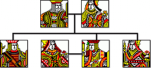

# The Family Pack TFP v0.3.0.1.1

Welcome to the current version of The Family Pack,
an ambitious multi-platform genealogy program
with a new evidence based database.

**THIS PROGRAM IS NOT FOR PRODUCTIVE USE**

The documentation for the program
will be added to the manual as it is developed,
including a tutorial. 
The manual for the version under development can be found at
[thefamilypack.org/dev/man/index.htm](http://thefamilypack.org/dev/man/index.htm)

The previous version v0.3.0.1.0 was released many years ago.
Since then the database design has changed out of all recognition
and the application has many additions.
Despite the above disclaimer,
I have been using it to hold my own family tree.
I have decided to release some interim versions
because, with care,
it can be used to explore the database system I have been devising.

For more details and links to a compiled Windows version, please visit the website at http://thefamilypack.org

The source code has also been compiled on gnu/linux Ubuntu
and Mac OSX.
See the file build/build.txt for a description of the build process.
I am still working on producing binaries for these platforms.
